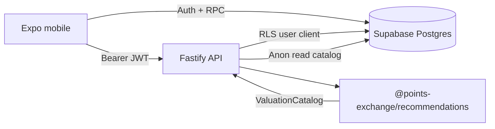

# Points Exchange

Points Exchange helps people decide how to use credit-card and bank rewards points. Users enter (or sync) balances across programs, pick a redemption goal, and get **deterministic** recommendations: estimated dollar value, difficulty, curated offers, and—when relevant—a modeled transfer path. Dollar math and cents-per-point (CPP) estimates come from **catalog rules and graph data in Postgres**, not from an LLM.

## Monorepo layout

| Path | Role |
|------|------|
| [`apps/mobile`](apps/mobile/README.md) | Expo (React Native) client — auth, dashboard, recommendation detail |
| [`apps/api`](apps/api/README.md) | Fastify HTTP API — profile, balances, recommendations, catalog |
| [`packages/recommendations`](packages/recommendations/README.md) | Valuation engine + strategy ranking + offer generation |
| [`packages/shared`](packages/shared/README.md) | Zod schemas and shared types for API, mobile, and engine |
| [`supabase`](supabase/README.md) | Postgres schema, seeds, and migration workflow |

## Prerequisites

- **Node.js** 20+
- **npm** (workspaces)
- **Supabase** project (URL + publishable/anon key)
- **Docker Desktop** (optional, for local `supabase db reset`)
- **Expo Go** or iOS/Android simulator (for mobile)

## Quick start

### 1. Install dependencies

From the repo root:

```bash
npm install
```

`postinstall` builds `@points-exchange/shared` and `@points-exchange/recommendations`.

### 2. Database

Link your Supabase project and apply migrations (see [supabase/README.md](supabase/README.md)):

```bash
supabase login
supabase link --project-ref YOUR_PROJECT_REF
supabase db push
```

For a clean dev database: `supabase db reset --linked` (wipes auth + data).

### 3. API server

```bash
cp apps/api/.env.example apps/api/.env
# Set SUPABASE_URL and SUPABASE_PUBLISHABLE_KEY
npm run dev:api
```

Default: `http://localhost:3000` — health check at `GET /health`.

### 4. Mobile app

```bash
cp apps/mobile/.env.example apps/mobile/.env
# Same Supabase values with EXPO_PUBLIC_ prefix; set EXPO_PUBLIC_API_URL
npm run dev:mobile
```

Use `http://localhost:3000` in the simulator; on a physical device use your machine’s LAN IP for `EXPO_PUBLIC_API_URL`.

## Architecture (high level)



1. **Catalog** — valuation rules, transfer edges, bonuses, products, offers, and goal targets live in Supabase and are loaded into a `ValuationCatalog` object.
2. **User context** — profile (goal), and per-program balances.
3. **Engine** — computes strategy cards, ranked dashboard order, offer lists, and transfer-path explanations.
4. **API** — authenticates with Supabase JWT, loads data, calls the engine, returns JSON.

## Documentation map

- **Run the API and endpoint reference:** [apps/api/README.md](apps/api/README.md)
- **Run the mobile app:** [apps/mobile/README.md](apps/mobile/README.md)
- **Valuation phases, strategies, ranking:** [packages/recommendations/README.md](packages/recommendations/README.md)
- **Shared types and validation:** [packages/shared/README.md](packages/shared/README.md)
- **Schema and migrations:** [supabase/README.md](supabase/README.md)

## Scripts (root)

| Script | Description |
|--------|-------------|
| `npm run dev:api` | Start API with hot reload (`tsx watch`) |
| `npm run dev:mobile` | Start Expo dev server |
| `npm run build:shared` | Build shared package |
| `npm run build:recommendations` | Build recommendations package |
