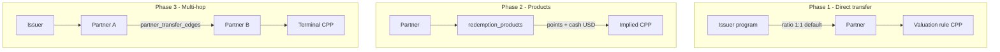

# Recommendations & valuation engine

`@points-exchange/recommendations` is the **deterministic** core of Points Exchange. Given a `ValuationCatalog` (from Postgres), user balances, and a goal, it produces:

- Dashboard strategy cards (estimated value range, difficulty, taglines)
- **Goal-weighted ranking** of which strategies appear first
- Per-strategy **offer lists** from catalog templates
- **Transfer path** traces for explainability (issuer → partner hops → terminal CPP)

No LLM is used for CPP or dollar amounts; numbers come from rules, products, and graph math.

## Build

```bash
npm run build --workspace=@points-exchange/recommendations
```

The API imports compiled output via the workspace dependency. Root `postinstall` builds this package automatically.

## Inputs

| Input | Source | Role |
|-------|--------|------|
| `ValuationCatalog` | API `loadValuationCatalog()` | Rules, offers, products, issuer→partner edges, partner→partner edges, bonuses, goal targets |
| `RewardBalanceInput[]` | `user_reward_balances` | Points per program |
| `GoalContext` | `users_profile` | `goalPreference`, optional `customGoalCode` |

Catalog shape is defined in `@points-exchange/shared` (`valuationCatalogSchema`).

## Strategies (recommendation ids)

Each dashboard card maps to a **canonical strategy id**:

| Id | Focus | Typical redemption methods |
|----|--------|----------------------------|
| `MOST_EFFECTIVE` | Highest value across programs | Transfer partners |
| `LEAST_HASSLE` | Simplest path on primary program | Portal / easy transfer |
| `LIMITED_TIME` | Time-sensitive highlights | Offers with short expiry |
| `TRAVEL_PORTAL` | Issuer travel portal | Portal |
| `SIMPLE_CASH` | Cash back / statement credit | Cashback |

Legacy ids (`BEST_VALUE`, `EASIEST`, `BEST_FOR_TRAVEL`) map to the above via `normalizeRecommendationId()` in `strategies.ts`.

`dashboardStrategyIds(goal)` picks which strategies are **eligible** for a goal; `dashboardStrategyIdsRanked()` reorders them by score (Phase 4). The dashboard shows up to `DASHBOARD_PRIMARY_LIMIT` (3) strategies without padding fake “see more” slots.

## Valuation mechanism (phased)

The engine treats redemption as a **graph**:

- **Issuer nodes** — Chase UR, Amex MR, etc.
- **Partner nodes** — United, Hyatt, Flying Blue, …
- **Terminal valuation** — CPP at a partner or method from rules / named products



### Phase 1 — Issuer → partner (direct)

**Files:** `valuation/phase1DirectTransfer.ts`, `valuation/transferMath.ts`

- Uses `catalog.issuerTransferEdges` (from `reward_program_transfer_partners`).
- Converts issuer points to partner points with `transfer_ratio_num` / `transfer_ratio_den`.
- Applies active **issuer→partner** bonuses from `transfer_bonuses` when `reward_program_id` is set.
- Compares **effective issuer CPP** against partner-specific rules or generic transfer CPP.

Phase 1 entry points delegate to Phase 3 when the catalog includes a full graph.

### Phase 2 — Redemption products (leaves)

**Files:** `valuation/phase2TransferProducts.ts`, `valuation/partnerTerminalCpp.ts`

- `redemption_products` rows are concrete **points → cash** pairs (e.g. “United Saver, U.S. to Europe”).
- `cppDbFromPartnerProduct` = `cash_value_usd / points_required * 100`.
- `bestDbCppFromIssuerTransferProducts` picks the best product-linked CPP reachable by direct transfer from an issuer.

Offers may reference a product via `redemption_product_key` for consistent copy and math.

### Phase 3 — Multi-hop path search

**Files:** `valuation/phase3PathSearch.ts`

- Walks `partner_transfer_edges` (partner → partner) with a cap of **`MAX_TRANSFER_PATH_HOPS` = 3** transfer edges after the issuer hop.
- Each hop applies ratio math and optional **partner→partner** bonuses (`from_partner_id` set on `transfer_bonuses`).
- Terminal CPP at the final partner: max of partner-specific valuation rules and product-implied CPP (`bestPartnerDenominatedCppDb`).
- `findBestTransferPathSummary` / `bestDbCppFromTransferPaths` return the path with best **issuer-side effective CPP**.

### Phase 4 — Ranking & explainability

**Files:** `valuation/phase4Ranking.ts`, `valuation/strategyRanking.ts`, `valuation/phase4TransferPathExplanation.ts`

**Ranking**

- `goalRankingWeights(goal)` balances **value** vs **ease** (e.g. `KEEP_IT_SIMPLE` favors easy redemptions).
- `rankStrategiesForGoal()` scores each strategy using estimated dollars and difficulty.
- Editorial order in `strategies.ts` breaks ties after scoring.

**Explainability**

- `weightedBestTransferPathSummary` builds a portfolio-level path across balances.
- `buildTransferPathExplanation` produces step labels for the mobile **Transfer path** hero.
- `RecommendationDetail` may include `transferPath` and `rankingRationale`.

## Main engine flows

| Function | Purpose |
|----------|---------|
| `buildDashboardSummary` | Points breakdown, ranked strategy list, preview cards |
| `buildRecommendationDetail` | Full copy, offers, next steps, transfer path for one id |
| `buildOffers` | Expand catalog templates per user programs |
| `listOffersForRecommendation` | Filter offers by strategy’s `offerMethods` |
| `resolveMethodCpp` | CPP for cashback / portal / transfer from rules |
| `valueRangeForBalances` | Min/max/typical dollars across portfolio |

`engine.ts` orchestrates these; `defaultCatalog.ts` provides a fallback catalog for tests or offline use.

## Custom goals

When `goalPreference === 'CUSTOM'`, `customGoalTuning.ts` supplies optional CPP hints per `customGoalCode`. Path search may be simplified for CUSTOM compared to preset goals that map cleanly to transfer/portal/cash strategies.

## Where this runs

| Consumer | Usage |
|----------|--------|
| `apps/api` | `lib/recommendations-service.ts` wraps engine with Supabase-loaded catalog |
| `apps/mobile` | Indirectly via API responses; types mirrored in `types/models.ts` |

## Catalog data (Supabase)

Tables consumed by `apps/api/src/lib/valuation-catalog.ts`:

- `valuation_rules` — CPP bands by program × method (× optional partner)
- `reward_program_transfer_partners` — issuer → partner edges
- `partner_transfer_edges` — partner → partner edges
- `transfer_bonuses` — time-boxed % bonuses
- `redemption_products` — named leaves
- `redemption_offers` — promotional templates
- `goal_redemption_targets` — goal copy / baseline points targets

See [supabase/README.md](../../supabase/README.md) for migration and seed files.

## Extending the engine

1. **New program or partner** — seed `reward_programs`, `transfer_partners`, edges, and rules; no engine change if codes follow existing patterns.
2. **New strategy** — add to `STRATEGY_DEFS` in `strategies.ts`, wire goal mapping, and ensure offer filters match `redemption_method_code` in seeds.
3. **New hop type** — extend catalog schema in `shared`, loader in API, and path search in Phase 3.

Keep new dollar logic in this package (or shared schemas), not in the mobile UI.
